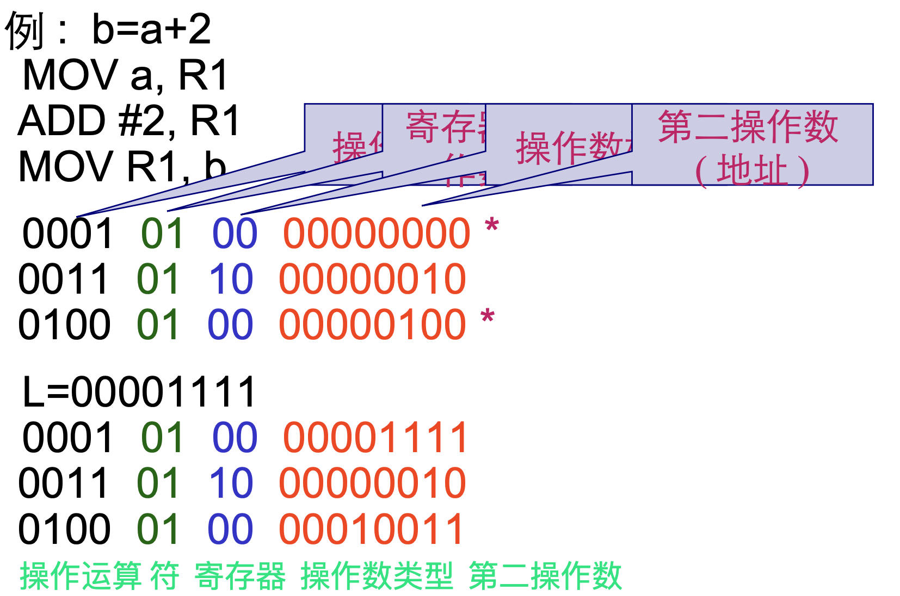

# 01.引论

## 简介

什么是编译程序

- 翻译程序: 把某一种语言程序 ( 称为源语言程序 ) 等价地转换成另一种语言程序 ( 称为目标语言程序 ) 的程序


- 编译程序 (compiler): 
  - 把某一种高级语言程序等价地转换成另一种低级语言程序 ( 如汇编语言或机器语言程序 ) 的程序
  - 诊断编译程序
  - 优化编译程序
  - 交叉编译程序：在宿主机写，在目标机用
  - 可变目标编译程序：在宿主机写，然后可以拿到不同版本的编译结果，在不同的目标机用


- 解释程序: 把源语言写的源程序作为输入，但不产生目标 程序，而是边解释边执行源程序本身


### 抽象(Abstraction)

- 定义：

  - 抽象就是忽略一个主题中与当前问题 ( 或目标 ) 无关的那些方面，以便更充分地注意与当前问题 ( 或目标 ) 有关的方面

  - 抽象是从众多的事物中抽取出共同的、本质性的特征，舍弃其非本质的特征

  - 抽象是一种从个体把握一般、从现象把握本质的认知过程和思维方法

- 编译原理中的 " 抽象 "
  - 有限自动机
  - 形式文法
  - ...

### 自动化

- 定义

  - 将抽象思维的结果在计算机上进行实现，是一 个将计算思维成果物化的过程，也是将理论成 果应用于技术的实践

  - 自动化的思维方法不仅体现在编译程序本身的 工作机制上，更体现在了编译程序的生成工具 的研究和设计上

- 编译原理中的 " 自动化 "
  - 有限自动机
  - 预测分析程序
  - 算符优先分析
  - LR 分析
  - ...

### 分解

- 分解 (Decomposition)
  - 将大规模的复杂问题分解成若干个较小规模的 、更简单的问题加以解决
  - 明确描述问题，并对问题解法作出全局性决策
  - 把问题分解成相对独立的子问题
  - 再以同样的方式对每个子问题进一步精确化，直到 获得对问题的明确的解答


### 递归

- 定义
  - 问题的解决又依赖于类似问题的解决，只不过后者的复杂程度或规模较原来的问题更小
  - 一旦将问题的复杂程度和规模化简到足够小时 ，问题的解法其实非常简单

- 编译原理中的 " 递归 "
  - 递归下降分析
  - 基于树遍历的属性计算
  - 语法制导翻译
  - ...

### 权衡 ( 折中 )

- 定义
  - 理论可实现 vs. 实际可实现
  - 理论研究重在探寻问题求解的方法，对于理论成果的研究运用又需要在能力和运用中作出权衡

- 编译原理中的 " 权衡 "
  - 用上下文无关文法来描述和处理高级程序设计 语言
  - 优化措施的选择
  - ...

## 编译过程


### 词法分析

- 任务: 输入源程序，对构成源程序的字符 串进行扫描和分解，识别出一个个单词符号
- 依循的原则:构词规则
- 描述工具:有限自动机

```
FOR      I      :=     1      TO     100     DO
基本字   标识符  赋值号  整常数  基本字  整常数  基本字
```

### 语法分析

- 任务:在词法分析的基础上，根据语言的语法规则把单词符号串分解成各类语法单位 ( 语法范畴 )

- 依循的原则:语法规则
- 描述工具:上下文无关文法


### 中间代码产生

- 任务:对各类不同语法范畴按语言的语义进行初步翻译

- 依循的原则:语义规则
- 中间代码:三元式，四元式，树


### 优化

- 任务:对于前阶段产生的中间代码进行 加工变换，以期在最后阶段产生更高效 的目标代码
- 依循的原则:程序的等价变换规则

优化前：


优化后：


### 目标代码产生

- 任务 : 把中间代码变换成特定机器上的目标代码
- 依赖于硬件系统结构和机器指令的含义
- 目标代码三种形式
- 绝对指令代码 : 
  - 可直接运行
  - 可重新定位指令代码 : 需要连接装配
  - 汇编指令代码 : 需要进行汇编




## 编译程序的结构

- 编译程序总框  表格与表格管理
- 出错处理
- 遍
- 编译前端与后端

### 总框


### 表格和表格管理

- 常见的表格：符号名表，常数表，标号表，入口名表，过程引用表

- 格式

```
[ 名字 | 信息 ]
```

### 出错处理

- 出错处理程序
  - 发现源程序中的错误，把有关错误信息报告给用户
- 语法错误
  - 源程序中不符合语法(或词法)规则的错误  非法字符、括号不匹配、缺少 ;、 ...

- 语义错误
  - 源程序中不符合语义规则的错误
  - 说明错误、作用域错误、类型不一致、 ...

### 遍 (pass)

- 所谓 " 遍 " ， 就是对源程序或源程序的中间表示从头到尾扫描一次

- 阶段与遍是不同的概念
  - 一遍可以由若干段组成
  - 一个阶段也可以分若干遍来完成

### 编译前端与后端


- 编译前端
  - 与源语言有关，如词法分析，语法分析，语义分析与 中间代码产生，与机器无关的优化
- 编译后端
  - 与目标机有关，与目标机有关的优化，目标代码产生

- 带来的好处
  - 程序逻辑结构清晰
  - 优化更充分，有利于移植

## 编译程序生成

- 以汇编语言和机器语言为工具
  - 优点 : 可以针对具体的机器，充分发挥计 算机的系统功能;生成的程序效率高
  - 缺点 : 程序难读、难写、易出错、难维护 、生产的效率低

- 高级语言书写: 利用已有的某种语言的编译程序实现另一语言 的编译程序


- 移植方法: 把一种机器上的编译程序移植到另一种机器上


- 自展技术


- 编译程序自动产生: 编译程序 - 编译程序，编译程序书写系统


