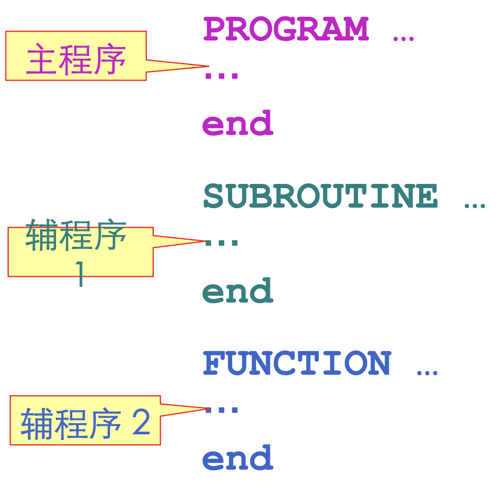
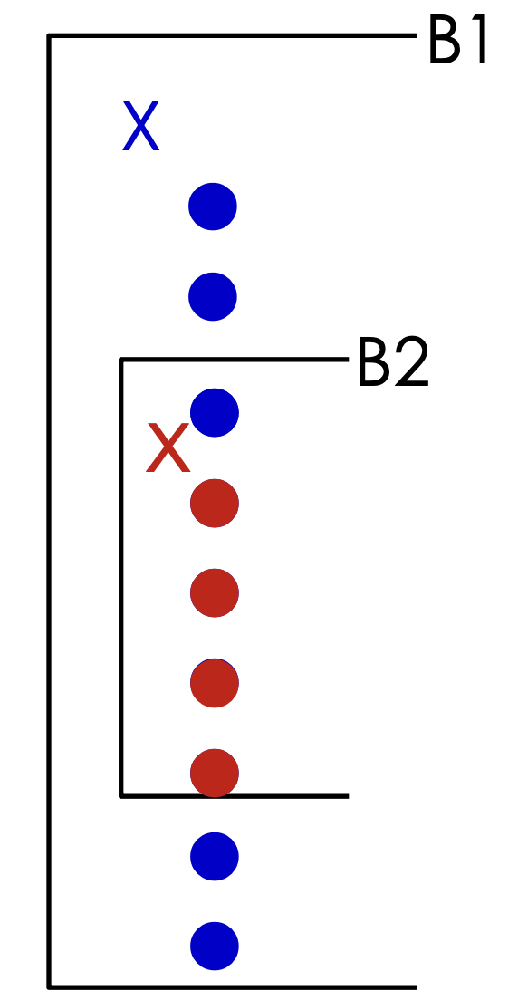
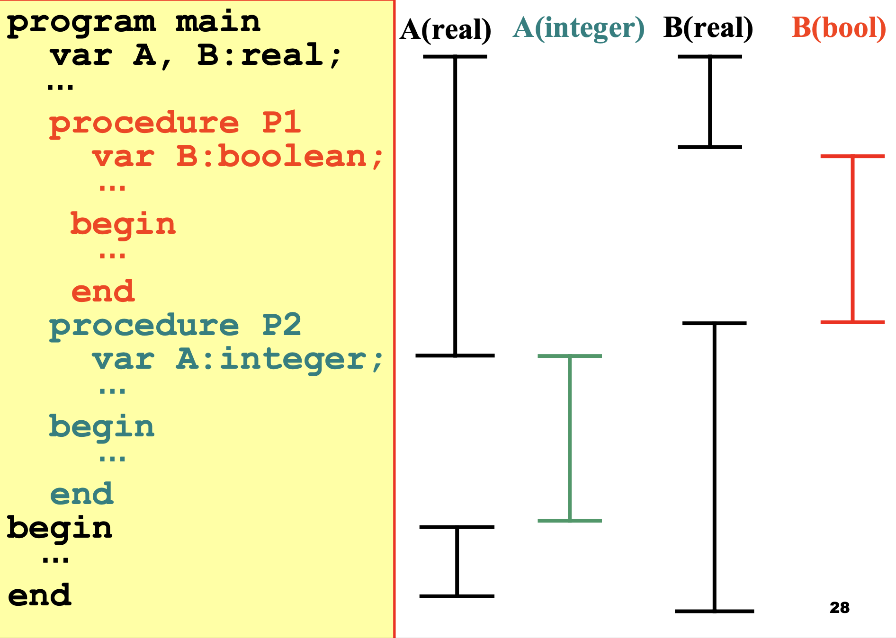
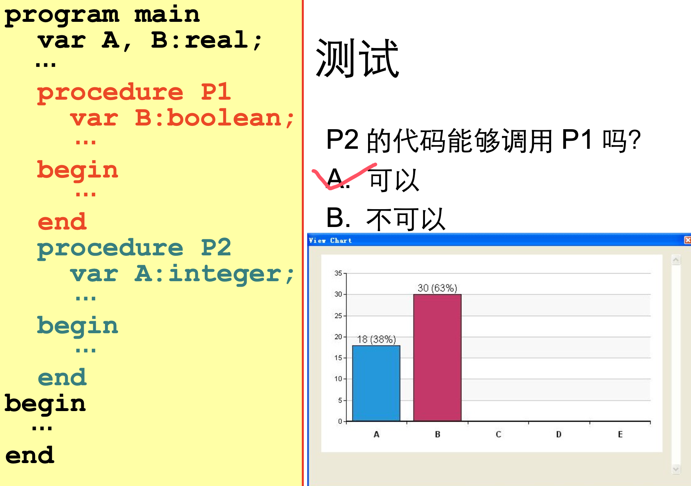
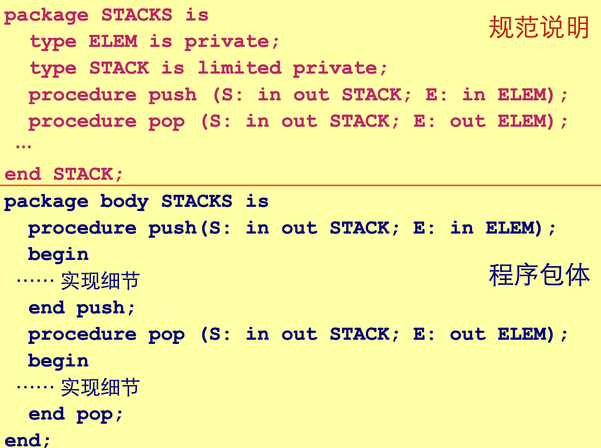
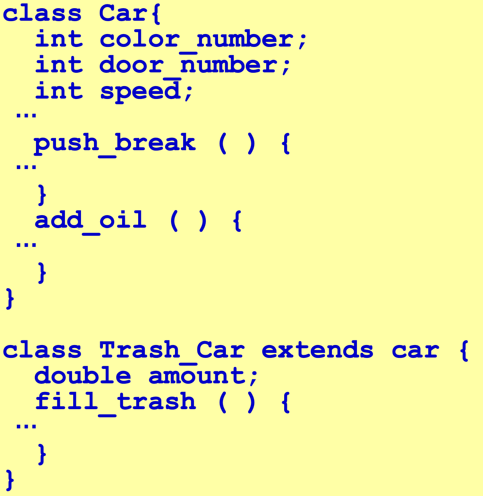

# 02.1程序语言的定义与高级语言分类

## 程序语言的定义

程序语言由两方面定义： **语法**，**语义**，语用

### 语法

- 程序本质上是一定字符集上的字符串
- 语法: 一组规则，用它可以形成和产生一个合式 (well-formed) 的程序

- 词法规则: 单词符号的形成规则
  - 单词符号是语言中具有独立意义的最基本结构
  - 一般包括:常数、标识符、基本字、算符、界符等
  - 描述工具:有限自动机
- 语法规则:语法单位的形成规则
  - 语法单位通常包括:表达式、语句、分程序、过程、函数、程序等 ;
  - 描述工具:上下文无关文法

```
E → i
E → E+E
E → E*E
E → (E)
```

- 语法规则和词法规则定义了程序的形式结构
- 定义语法单位的意义属于语义问题

### 语义

- 定义：一组规则，用它可以定义一个程序的意义
- 描述方法
  - 自然语言描述：隐藏错误、二义性和不完整性
  - 形式描述：
    - 操作语义 (PL/1)
    - 指称语义 (ADA)
    - 代数语义 (PASCAL)

## 程序语言的基本功能和层次结构

- 程序语言的基本功能：描述数据和对数据的运算
- 所谓程序，本质上说是描述一定数据的处理过程

```
            程序
             |
   子程序或分程序、过程、函数
             |
            语句
             |
           表达式
             |
     数据引用 运算符 函数调用
```

程序语言成分的逻辑和实现意义:

-  抽象的逻辑的意义: 数学意义
- 计算机实现的意义: 具体实现

比如：0.3在数学上是明确的，而用计算机中二进制的表示却不精确

## 高级语言的一般特性

- 高级语言的分类
  - 强制式语言 (Imperative Languge)/ 过程式语言
    - 命令驱动，面向语句
    - FORTRAN 、 C 、 Pascal ， Ada
  - 应用式语言 (Applicative Language)
    - 注重程序所表示的功能，而不是一个语句接一个语句地执行
    - LISP 、 ML
  - 基于规则的语言 ( Rule-based Language)
    - 检查一定的条件，当它满足值，则执行适当的动作
    - Prolog
  - 面向对象语言 (Object-Oriented Language)
    - 封装性、继承性和多态性
    - Smalltalk ， C++ ， Java

## 程序结构

- 程序结构：FORTRAN
  - PASCAL 程序本身可以看成是一个操作系统所调用的过程，过程可以嵌套和递归
  - 一个 PASCAL 过程

```solidity
过程头;
   说明段(由一系列的说明语句组成);
begin 
	 执行体(由一系列的执行语句组成);
end
```

下图的说明：

- 一个程序由一个主程序段和若干辅程序段组成
- 辅程序段可以是子程序、函数段或数据块
- 每个程序段有一系列的说明语句和执行语句组成，各段可以独立编译
- 模块结构，没有嵌套和递归
- 各程序段中的名字相互独立，同一个标识符在不同的程序段中代表不同的名字



### 作用域

- 作用域：一个名字能被使用的区域范围称作这个名字的作用域

- 允许同一个标识符在不同过程中代表不同的 名字

- 名字作用域规则—— " 最近嵌套原则 "

### 最近嵌套原则

- 一个在子程序 B1 中说明的名字 X 只在 B1 中有效(局部于 B1)

- 如果 B2 是 B1 的一个内层子程 序且 B2 中对标识符 X 没有新的 说明，则原来的名字 X 在 B2 中 仍然有效

- 如果 B2 对 X 重新作了说明，那 么， B2 对 X 的任何引用都是指 重新说明过的这个 X







### 其他语言

ADA

- 程序包 (package)
  - 把数据和操作代码封装在一起，支持数据抽象
- 一个程序包分为两部分
  - 可见的规范说明部分，它定义了程序包外面可以访 问的对象
  - 程序包体，它实际定义程序包的实现细节



JAVA

- 面向对象的高级语言  类( Class )
- 继承 (Inheritance)
- 多态性 (Polymorphism) 和动态绑定 (Dynamic binding)




