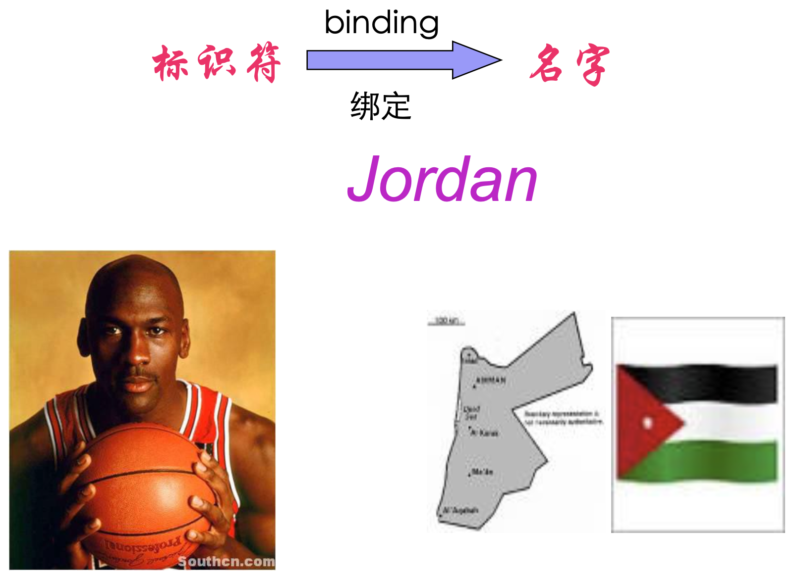
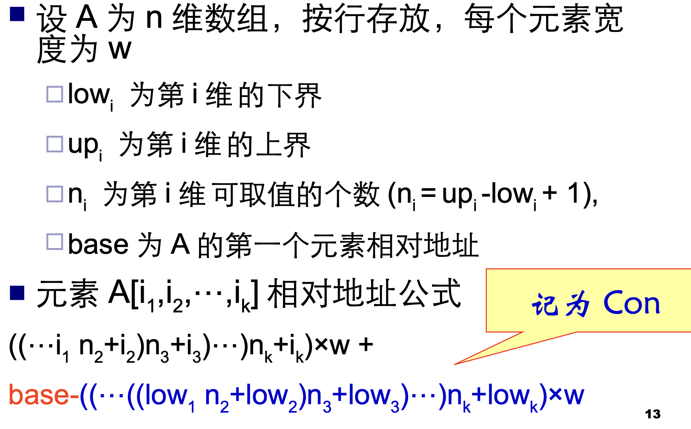
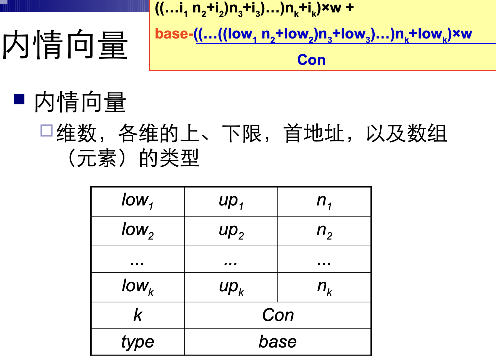

# 程序语言的一般特性

## 数据类型与操作

-  一个数据类型通常包括三种要素
  - 用于区别这种类型数据对象的属性
  - 这种类型的数据对象可以具有的值
  - 可以作用于这种类型的数据对象的操作

- 初等数据类型
  - 数值类型
    - 整型、实型、复数、双精度
    - 运算: + ， - ， * ， / 等
  - 逻辑类型
    - true 、 false
    - 布尔运算:∨，∧，┑等
  - 字符类型:符号处理
  - 指针类型

### 标识符与名字

- 标识符：以字母开头的，由字母数字组成的字符串
- 标识符与名字两者有本质区别
  - 标识符是语法概念
  - 名字有确切的意义和属性



- 名字
  - 值：单元中的内容
  - 属性：类型和作用域
- 名字的性质的说明方式
  - 由说明语句来明确规定的
  - 隐含说明：FORTRAN 以I,J,K,...N为首的名字代表整型,否则为实型
- 动态确定：走到哪里，是什么，算什么

### 数据结构

- 数组
  - 逻辑上，数组是由同一类型数据所组成的某种 n 维矩形结构，沿着每一维的距离，称为下标
  - 数组可变与不可变：编译时能否确定其存贮空间的大小
  - 访问：给出数组名和下标值
  - 存放方式：按行存放 , 按列存放

- 数组元素地址计算

  - 数组 A[10, 20] 的 A[1, 1] 为 a ，各维下标为 1 ，按行存放，那么 A[i, j] 地址为:

    ```
    a+(i-1)*20+(j-1)
    ```

  - 数组元素地址计算公式





### 记录/结构体

- 逻辑上说，记录结构由已知类型的数据组合在一起的一种结构

```
record {
    char NAME[20];
    integer AGE;
    bool MARRIED;
} CARD[1000]
```

- 访问: 复合名 CARD[k].NAME
- 存储:连续存放
- 域的地址计算：相对于记录结构起点的相对数 OFFSET

### 字符串、表格、栈

- 字符串：符号处理、公式处理
- 表格：本质上是一种记录结构
- 线性表：一组顺序化的记录结构
- 栈：一种线性表，后进先出， POP, PUSH

### 抽象数据类型

- 抽象就是忽略一个主题中与当前问题无关 的那些方面，以便更充分地注意与当前问 题有关的方面

- 提取和表现事物的核心特性，忽略细节

- 抽象数据类型 (Abstract Data Type)：A set of data values and associated operations that are precisely specified independent of any particular implementation.

- 一个抽象数据类型包括
  - 数据对象的一个集合
  - 作用于这些数据对象的抽象运算的集合
  - 这种类型对象的封装，即，除了使用类型中所定义 的运算外，用户不能对这些对象进行操作
- 程序设计语言对抽象数据类型的支持：
  - Ada 通过程序包 (package) 提供了数据封装的支持
  - Smalltalk 、 C++ 和 Java 则通过类 (Class) 对抽象 数据类型提供支持

## 语句与控制结构

- 表达式：表达式由运算量(也称操作数，即数据引用或 函数调用)和算符(操作符)组成
- 表达式形成规则

- 形式

```
中缀    前缀     后缀
X*Y     -A      P↑
```

### 算符的优先次序

- 一般的规定
  - PASCAL :左结合 A+B+C=(A+B)+C
  - FORTRAN :对于满足左、右结合的算符可 任取一种，如 A+B+C 就可以处理成 (A+B) +C ，也可以处理成 A+(B+C)

- 注意两点
  - 代数性质能引用到什么程度视具体的语言不同而不同
  - 在数学上成立的代数性质在计算机上未必完全成立

### 语句

- 赋值语句
  - A := B
  - 名字左值:该名字代表的那个单元 ( 地址 ) 称 为该名字的左值 ( 所代表的存贮单元的地址 )
  - 右值:一个名字的值称为该名字的右值 ( 所代 表的存贮单元的内容 )
- 说明语句：定义各种不同数据类型的变量或运算，定义名字的性质

### 简单句和复合句

- 简单句：不包含其他语句成分的基本句
- 复合句：句中有句的语句


