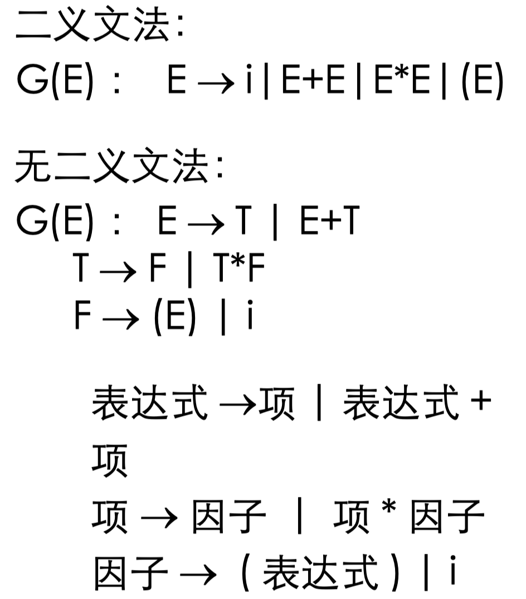

# 语言程序的语法描述

## 重要概念(记忆)

- `∑`：一个有穷字母表字符集，其中每一个元素称为一个字符
- `∑`上的字 ( 也叫字符串 ) ：指由`∑`中的字符所构成的 一个有穷序列
- `ε`：不包含任何字符的序列称为空字
- `∑ *` ：表示`∑`上的所有字的全体，包含空字 `ε`

> 例如 : 设 ∑ ={a ， b} ，则：
>
> ```
> ∑* = {ε,a,b,aa,ab,ba,bb,aaa,...}
> ```

- `∑ *` 的子集 U 和 V 的连接（积）定义为：

$$
UV = \{\,\alpha\beta \mid \alpha \in U \;\&\; \beta \in V\}
$$

> 例如：
>
> ```
> U ＝ { a, aa }, V ＝ { b, bb }
> 则：UV= { ab, abb, aab, aabb}
> ```

- V 自身的 n 次积记为：

$$
V^n = \underbrace{V\,V\,\dots\,V}_{n\text{ 次}}
$$

- 规定

$$
V^0 = \{\epsilon\}
$$

- 令公式(4)称 `V*` 是 `V` 的闭包

$$
V^* = V^0 \cup V^1 \cup V^2 \cup V^3 \cup \dots
$$

- 记下面的式子，称 V +是 V 的正规闭包

$$
V^+ = V\,V^*
$$

> 例如：U ＝ { a, aa }，那么：
>
> ```
> U* = { ε, a, aa, aaa, aaaa, …}
> U+ = {    a, aa, aaa, aaaa, …}
> ```

- 文法：描述语言的语法结构的形式规则

> 比如：
>
> He gave me a book.
>
> ```
> < 句子 >  →  < 主语 >< 谓语 >< 间接宾语 >< 直接宾语 >
> < 主语 >  →  < 代词 >
> < 谓语 >  →  < 动词 >
> < 间接宾语 >  →  < 代词 >
> < 直接宾语 >  →  < 冠词 > < 名词 >
> < 代词 >  →  He
> < 代词 >  →  me
> < 名词 >  →  book
> < 冠词 >  →  a
> < 动词 >  →  gave
> ```
>
> 一步一步推导：
>
> ```
> < 句子 >  →  < 主语 >< 谓语 >< 间接宾语 >< 直接宾语 >
> < 句子 >  →  < 代词 >< 谓语 >< 间接宾语 >< 直接宾语 >
> < 句子 >  →  He < 谓语 >< 间接宾语 >< 直接宾语 >
> < 句子 >  →  He < 动词 >< 间接宾语 >< 直接宾语 >
> < 句子 >  →  He gave < 间接宾语 >< 直接宾语 >
> < 句子 >  →  He gave < 代词 >< 直接宾语 >
> < 句子 >  →  He gave me < 直接宾语 >
> < 句子 >  →  He gave me < 冠词 >< 名词 >
> < 句子 >  →  He gave me a < 名词 >
> < 句子 >  →  He gave me a book
> ```

- 一个上下文无关文法 G 是一个四元式，公式(7)：

  - `V_T` ：终结符集合 ( 非空 )

  - `V_N`：非终结符集合 ( 非空 ) ，且`V_T`  ∩ `V_N` = ∅

  - `S` ：文法的开始符号， S ∈ `V_N`

  - `P` ：产生式集合 ( 有限 ) ，每个产生式形式为公式（6）
    $$
    P \to \alpha,\quad P \in V_N,\quad \alpha \in (V_T \cup V_N)^*
    $$
  - 开始符 `S` 至少必须在某个产生式的左部出现一次

$$
G = (V_T, V_N, S, P)
$$

> 例如：
>
> 定义只含 + ， * 的算术表达式的文法：`G=< {i ， + ， * ， ( ， )} ， {E} ， E ， P>`，其中， P 由下列产生式组成：
>
> ```
> E → i 
> E → E+E 
> E → E*E 
> E → (E)
> ```
>
> “→” 也可以用“ ::=" 表示， 这种表示称为巴科斯范式 (BNF)

- 上下文无关文法：定义符的左边一定是一个非终结符，右边是终结符和非终结符组成的任意串
- 表示一个文法时，通常只给出开始符号和产生式。

> 如上例，可表示为：
>
> ```
> G(E) ： E → i | E+E | E*E | (E)
> ```

- 定义：称αAβ直接推出αγβ，即公式(9)：

  - 仅当 A→γ是一个产生式

  - 且公式(8)：
    $$
    \alpha,\;\beta \in (\,V_T \cup V_N\,)^*
    $$

$$
\alpha A \beta \;\;\Rightarrow\;\; \alpha \gamma \beta
$$

- 如果α1⇒ α2 ⇒ ... ⇒αn，则我们称这个序列是从α1到αn到一个推导。若存在一个从α1到αn的推导，则称α1可以推导出αn
- 对文法`G(E) → i | E+E | E*E | (E)`，有：`E ⇒ (E) ⇒ (E+E) ⇒ (i+E) ⇒ (i+i)`

- 通常
  - 用公式(10)表示从α1出发，经过一步或若干步，可以推出αn
  - 用公式(11)表示从α1出发，经过零步或若干步，可以推出αn

$$
\alpha_1 \;\overset{+}{\Rightarrow}\; \alpha_n
$$

$$
\alpha_1 \;\overset{*}{\Rightarrow}\; \alpha_n
$$

> 所以，α⇒β即：α=β或α =+=> β

## 上下文无关文法

### 定义

- 定义：假定G是一个文法，S是它开始符号。如果S =*=>α，则称α是一个句型。仅仅含有终结符号的句型是一个句子。文法G所产生的 句子的全体是一个语言，将它记为：L(G)。

$$
L(G) = \{\,\alpha \mid S \;\overset{+}{\Rightarrow}\; \alpha,\;\alpha \in V_T^*\}
$$

- 从一个句型到另一个句型的推导往往不唯一：`E+E⇒i+E⇒i+i` 和 `E+E⇒E+i⇒i+i`
- 最左推导：任何一步α ⇒ β都是对α中的最左非终结符进行替换
- 最右推导：任何一步α ⇒ β都是对α中的最右非终结符进行替换

### 例子

例子1：


例子2:


例子3:


例子4:


例子5:


## 语法树与二义性 (ambiguity)

### 特点

- 定义：用一张图表示一个句型的推导 , 称为语法树
- 定义：如果一个文法存在某个句子对应两颗不同的语法树，则说这个文法是二义的

> `G(E) ： E → i|E+E|E*E|(E)`是二义文法

- 语言的二义性：一个语言是二义性的，如果对它不存在无二义性的文法

> 可能存在 G 和 G’ ，一个为二义的，一个为无二义 的。但 L(G)=L(G’)

- 二义性问题是不可判定问题，即不存在一个算法 ，它能在有限步骤内，确切地判定一个文法是否是二义的
- 可以找到一组无二义文法的充分条件
- 描述程序设计语言时，对于上下文无关文法的限制
  - 不含 P→P 形式的产生式
  - 每个非终结符 P 必须有用处，即公式（13）和（14）：


$$
S \stackrel{\ast}{\Rightarrow} \alpha P \beta
$$
$$
P \stackrel{\ast}{\Rightarrow} r \quad r \in V_T^{\ast}
$$

问：一个句型是否只对应唯一一棵语法树？回答：不


### 例子

例子1：


例子2: 




## 形式语言鸟瞰

### 特点

- 乔姆斯基 (Chomsky) 是美国当代有重大影响的语言学家

- 乔姆斯基于 1956 年建立形式语言体系，他把文法分成四种类型： 0 ， 1 ， 2 ， 3 型
- 与上下文无关文法一样，它们都由四部分组成，但对产生式的限制有所不同

- 四种文法：


- 能力比较：


### 例子

例子1:


### 现实

- PL中用的都是上下文无关文法，因为0，1型的实现起来非常复杂

> 计算思维的典型方法
>
> - 理论可实现 vs. 实际可实现
>
> - 理论研究重在探寻问题求解的方法，对于理论成果的研究运用又需要在能力和运用中作出权衡


