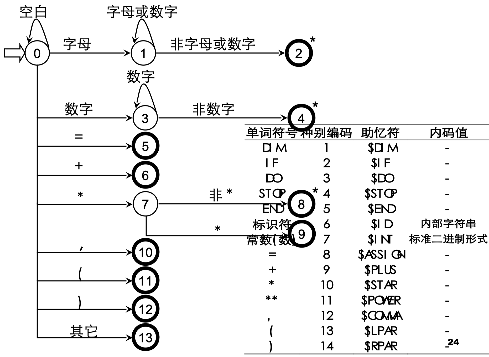

# 词法分析器的设计

## 对于词法分析器的要求

### 简介

- 词法分析的任务：从左至右逐个字符地对源程序进行扫描，产生一个个单词符号
- 词法分析器 (Lexical Analyzer) 又称扫描器 (Scanner)：执行词法分析的程序

- 功能：输入源程序、输出单词符号

- 单词符号的种类

  - 基本字：如 begin ， repeat ，...
  - 标识符：表示各种名字：如变量名、数组 名和过程名
  - 常数：各种类型的常数
  - 运算符： + ， - ， * ， / ，...
  - 界符：逗号、分号、括号和空白

- 输出的单词符号的表示形式：( 单词种别，单词自身的值 )

- 单词种别通常用整数编码表示

  - 若一个种别只有一个单词符号，则种别编码就代表该单词符号。假定基本字、运算符和界符都是一符一种。
  - 若一个种别有多个单词符号，则对于每个单词符号，给出种别编码和自身的值。
    - 标识符单列一种；标识符自身的值表示成按机器字节划分的内部码
    - 常数按类型分种；常数的值则表示成标准的二进制形式

  例子1：

  

例子2：

### 词法分析器作为一个独立子程序

- 词法分析是作为一个独立的阶段，是否应当将其处理为一遍呢？
  - 作为独立阶段的优点：结构简洁、清晰和条理化，有利于集中考虑词法分析一些枝节问题
  - 不作为一遍：将其处理为一个子程序

### 词法分析器在编译器中地位

## 词法分析器的设计

### 简介

词法分析器的结构：

输入、预处理：

单词符号的识别 : 超前搜索

> 几点限制——不必使用超前搜索
>
> - 所有基本字都是保留字 ; 用户不能用它们作自己的标识符
> - 基本字作为特殊的标识符来处理，使用保留字表
> - 如果基本字、标识符和常数 ( 或标号 ) 之间没有确定的运算符或界符作间隔，则必须使用一个空白符作间隔

### 状态转换图

- 状态转换图是一张有限方向图
  - 结点代表状态，用圆圈表示
  - 状态之间用箭弧连结，箭弧上的标记 ( 字符 ) 代表射出结状态下可能出现的输入字符或字符类
  - 一张转换图只包含有限个状态， 其中有一个为初态，至少要有一个终态

- 状态转换图可用于识别 ( 或接受 ) 一定的字符串：若存在一条从初态到某一终态的道路，且这条路上所有弧上的标记符连接成的字等于α，则称α为该状态转换图所识别 ( 接受 )

### 词法分析器的设计示例

助忆符：直接用编码表示不便于记忆，因此用助忆符来表示编码。

### 状态转换图的实现

- 全局变量与过程

  - ch 字符变量、存放最新读入的源程序字符
  - strToken 字符数组，存放构成单词符号的字符串
  - GetChar 子程序过程，把下一个字符读入到 ch 中
  - GetBC 子程序过程，跳过空白符，直至 ch 中读入一非空白符
  - Concat 子程序，把 ch 中的字符连接到 strToken
  - IsLetter 和 IsDisgital 布尔函数，判断 ch 中字符是否为字母和数字
  - Reserve 整型函数，对于 strToken 中 的字符串查找保留字表，若它实保留字则 给出它的编码，否则回送 0
  - Retract 子程序，把搜索指针回调一个字符位置
  - InsertId 整型函数，将 strToken 中的标 识符插入符号表，返回符号表指针
  - InsertConst 整型函数过程，将 strToken 中的常数插入常数表，返回常数表指针。

  例子1:

例子2:

例子3:

例子4:

