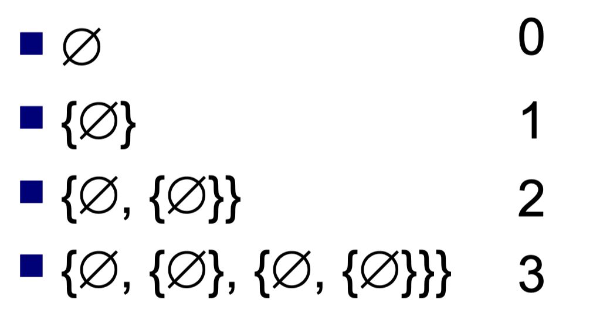
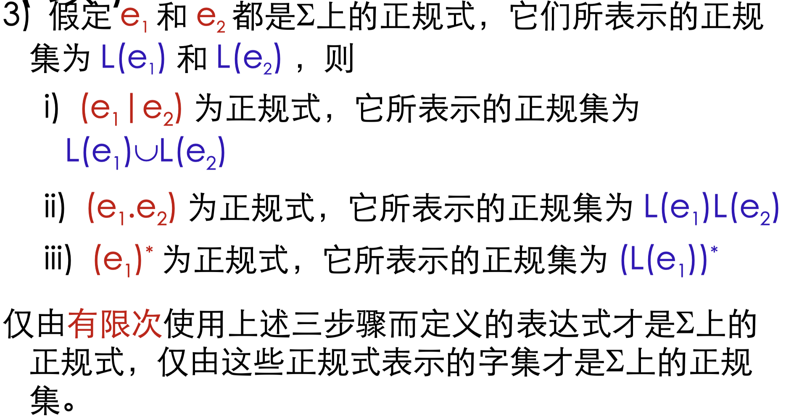
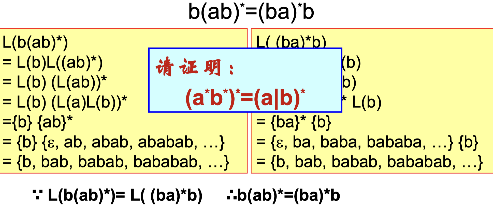
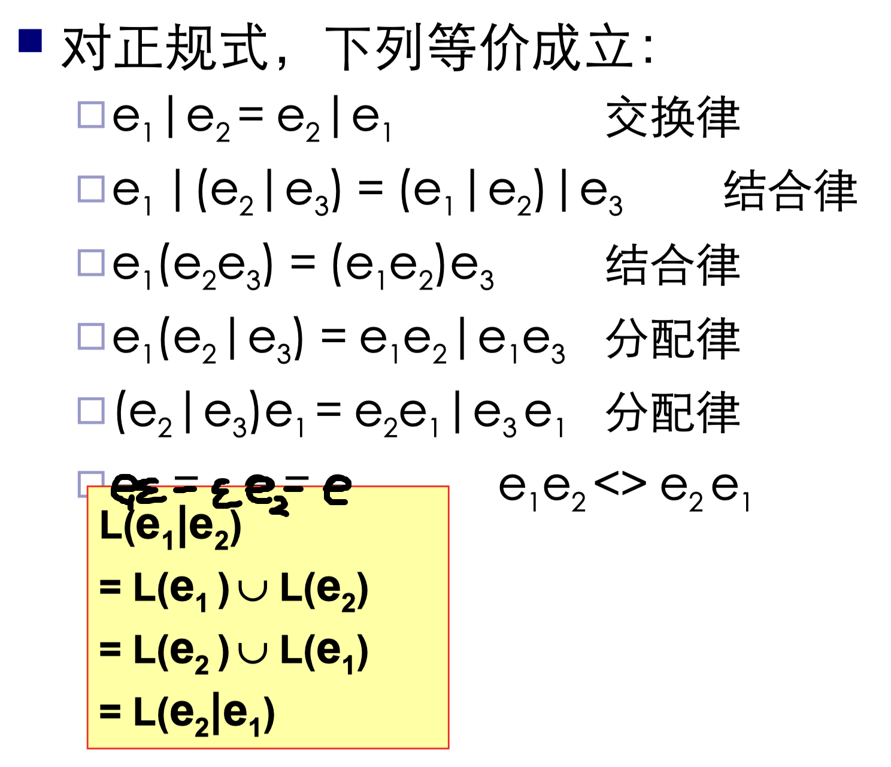
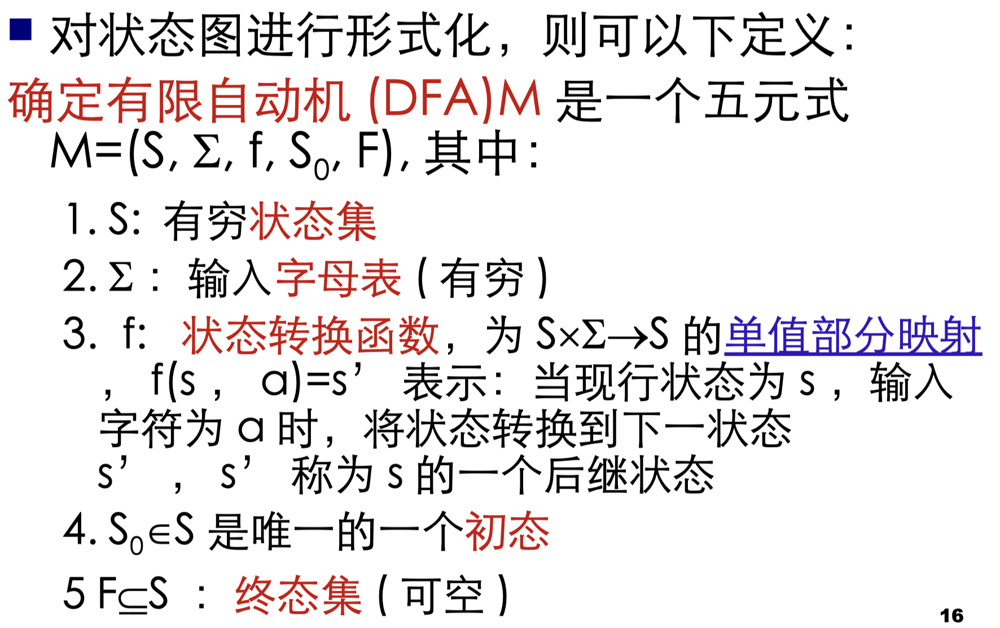
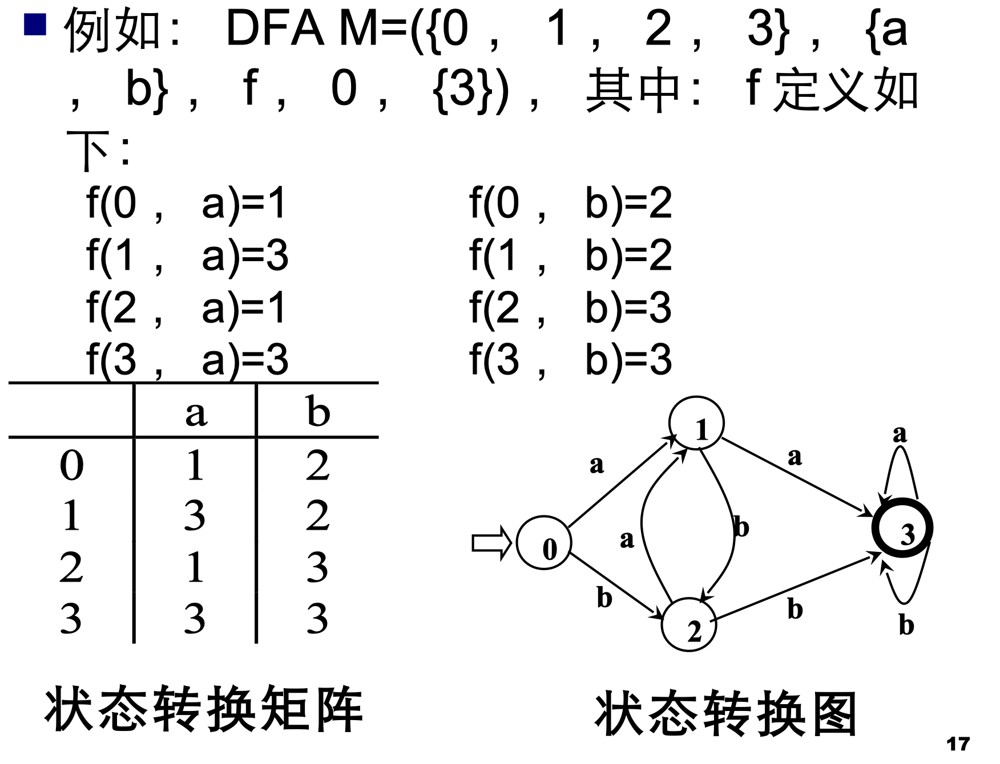
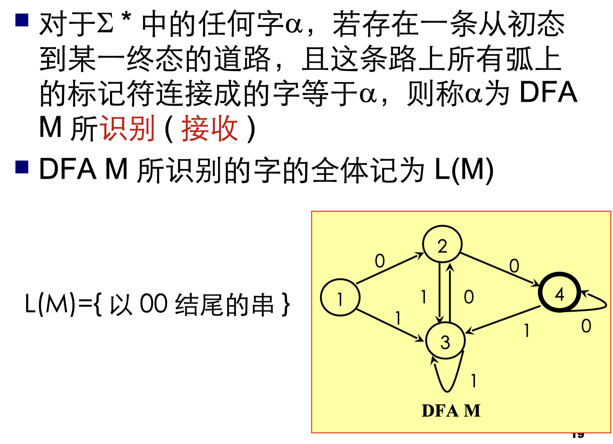
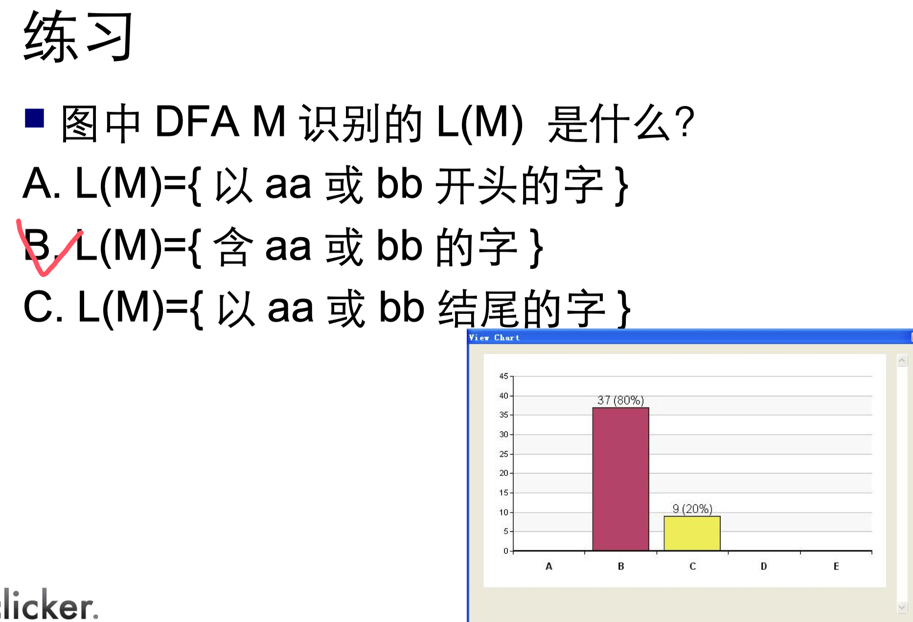
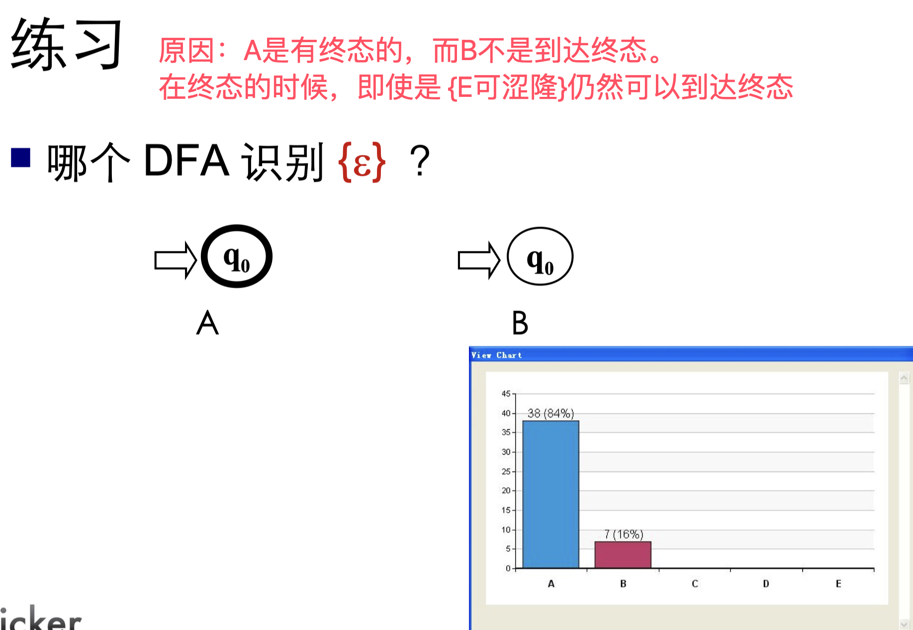
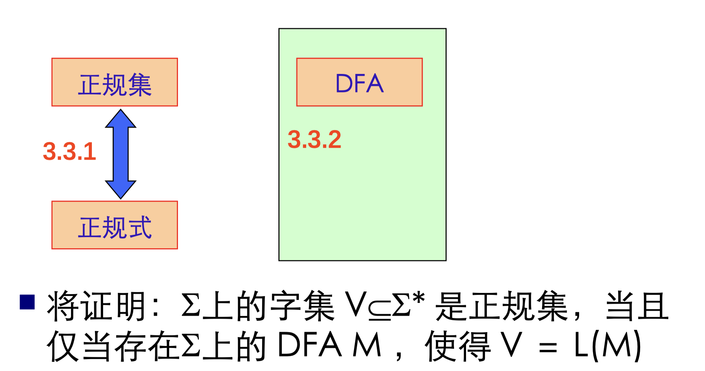

# 正规表达式与有限自动机

## 正规式和正规集

- 正规集可以用正规表达式（简称正规式）表示
- 正规表达式是表示正规集一种方法
- 一个字集合是正规集当且仅当它能用正规式表示

冯 - 诺伊曼构造自然数的方案

## 正规式和正规集的递归定义

对给定的字母表 ∑

1. ε 和 ∅ 都是 ∑ 上的正规式，它们所表示的正规集为 {ε} 和 ∅
2. 任何 α ∈ ∑ , α是 ∑上的正规式，它所表示 的正规集为{α}

- 所有词法结构一般都可以用正规式描述
- 若两个正规式所表示的正规集相同，则称这两个正规式等价。如:

- 对正规式，下列等价成立：

## 确定有限自动机 (DFA)

- 定义：

- 例子：

- DFA 可以表示为状态转换图
  - 假定 DFA M 含有 m 个状态和 n 个输入字符
  - 这个图含有 m 个状态结点，每个结点顶多含有 n 条箭弧射出，且每条箭弧用 Σ 上的不同的输入字符来作标记

## 关系图

